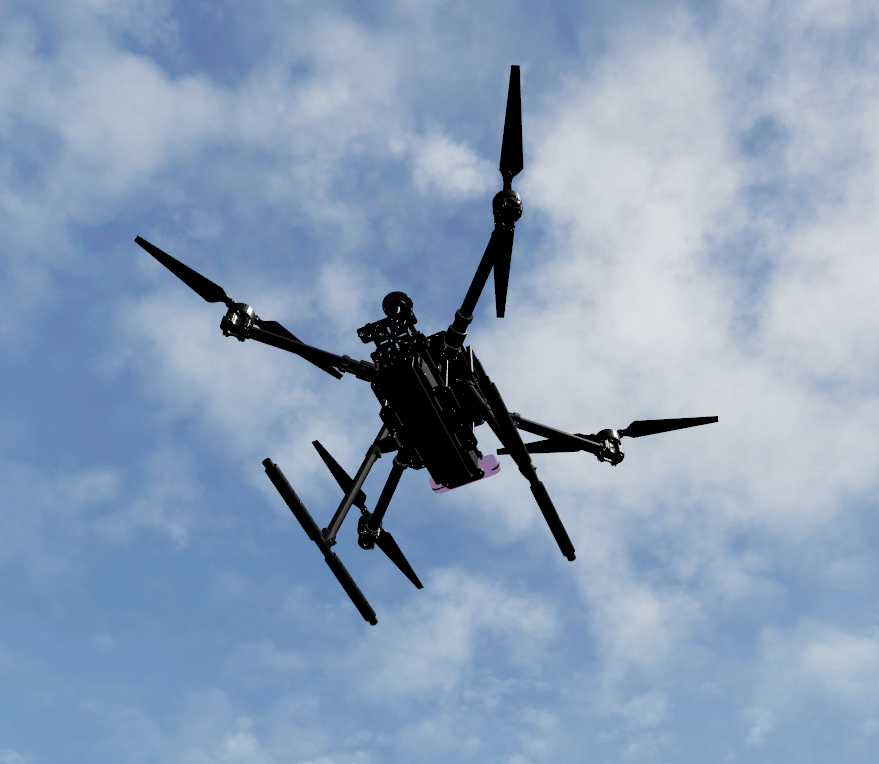
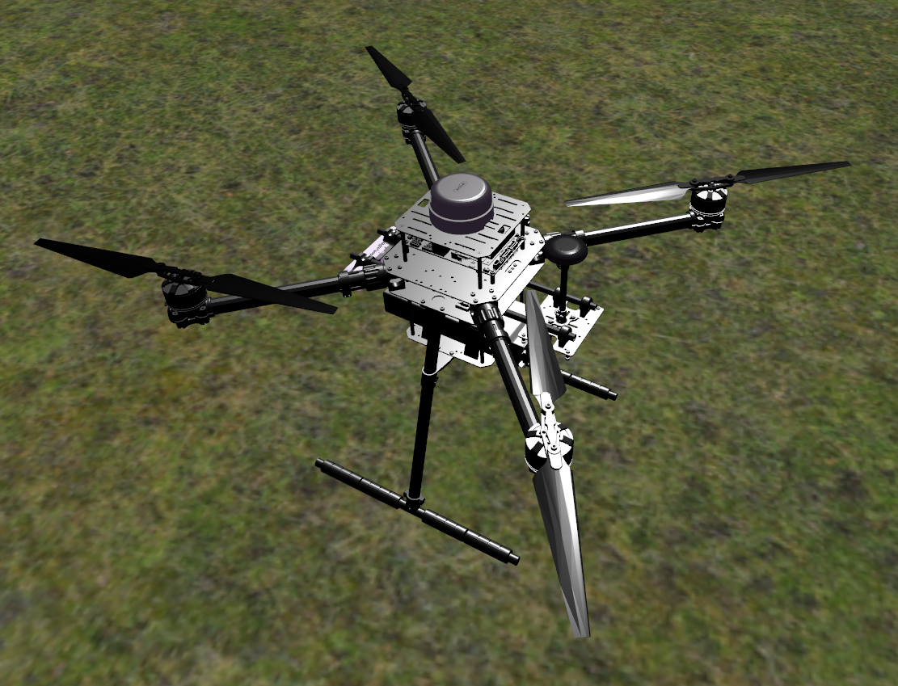
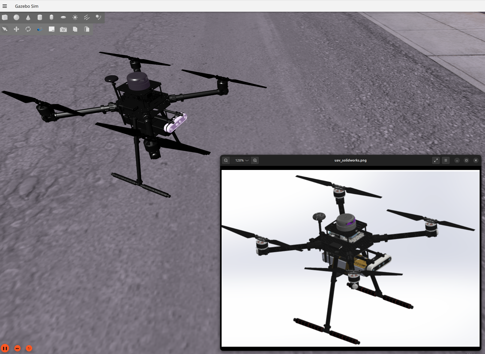
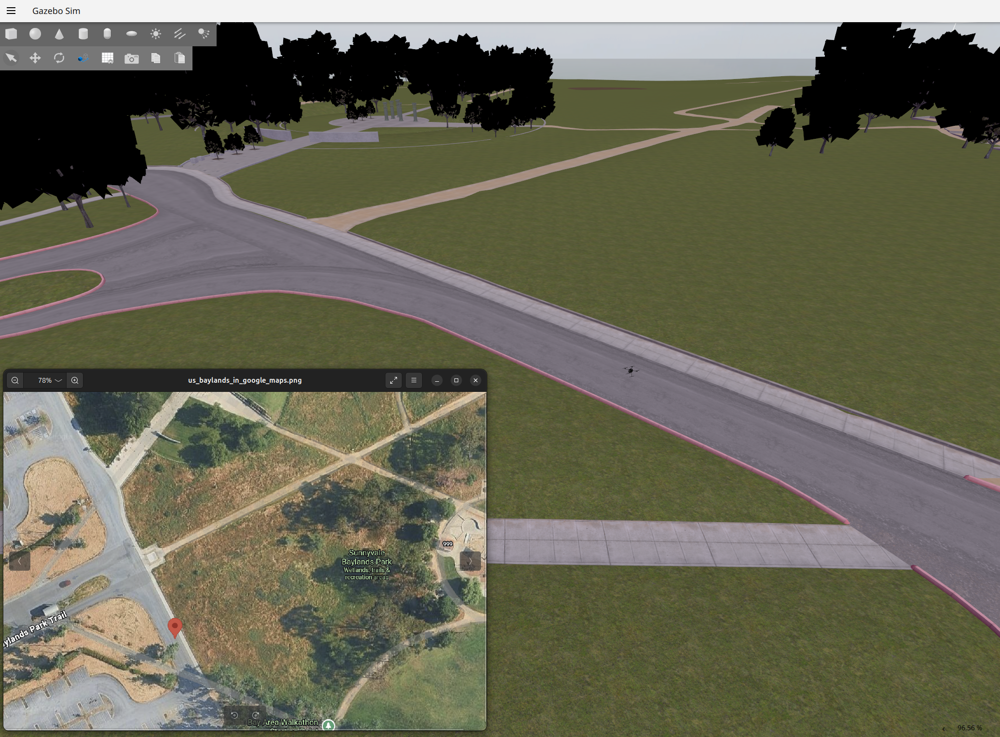
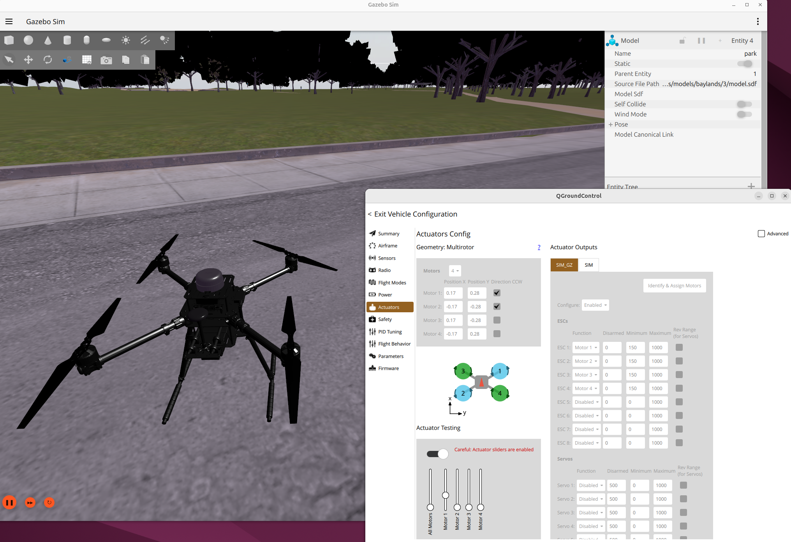
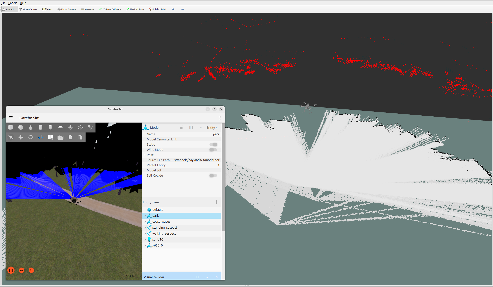
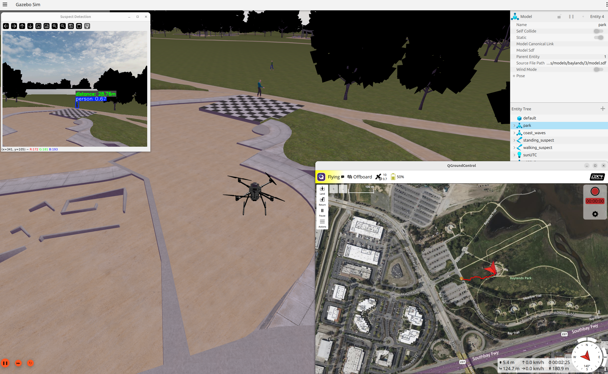
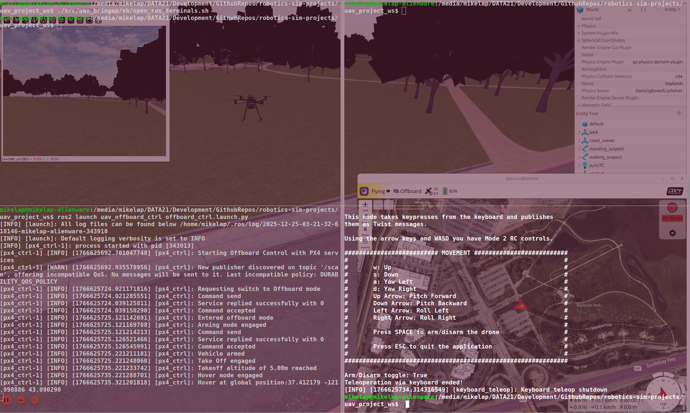

# AI-Driven UAV Simulation for Semantic Mapping and Human Detection with ROS 2, Gazebo, and Computer Vision

[](#)
[](#)
[](#)

 

## Description
This repository contains the project implementation for a Master's Thesis titled **"UAS Design and Simulation for Semantic Mapping and Human Detection using Computer Vision"**.

The project focuses on the development of an Unmanned Aerial Vehicle (UAV) application designed for manual keyboard-controlled navigation, real-time Simultaneous Localization and Mapping (SLAM) utilizing RTAB-Map (Real-Time Appearance-Based Mapping), and advanced computer vision-based human detection using YOLO. By leveraging custom CAD digital modeling, modern robotics frameworks, and artificial intelligence, this system establishes a scalable platform suitable for complex, large-scale missions such as surveillance, mapping, and search-and-rescue operations.

## Key Features and Project Status

*   **UAV Design & Export:** The structural geometry of the UAV was completely designed and assembled within **SolidWorks**. It was subsequently translated into physical model parameters using the **URDF Exporter** plugin to generate the exact URDF and STL assets required for the simulation environment.
*   **Manual Navigation (Current Implementation)**: Precise vehicle navigation is performed via manual keyboard control, allowing operators to maneuver through the environment dynamically.
**Multi-Sensor Fusion & Semantic SLAM:** Utilizes **RTAB-Map** for high-fidelity 3D Semantic Simultaneous Localization and Mapping (SLAM). Advanced sensor fusion is achieved within RTAB-Map by dynamically fusing incoming streams from a **depth camera**, **odometry data**, and **LiDAR data** to ensure robust localization and accurate real-time mapping in unmapped environments.
*   **AI-Powered Human Detection:** Integrates a robust **YOLO computer vision model** to accurately identify and track individuals in real time from the drone's sensory feed.
*   **High-Fidelity Simulation:** Built and tested inside a realistic physics simulation environment ensuring flight stability and reliable obstacle avoidance. The simulation leverages a highly accurate digital twin of **Baylands**, a real-world open-space environment located in California, USA, providing an authentic setting for testing outdoor flight behavior and sensor perception.

## Roadmap and Future Enhancements

*   **Yaw Axis Stabilization:** Debugging and refinement are underway to address current issues with the yaw rotation movement within the PX4 Autopilot stack integration to ensure fully predictable rotational control.
*   **3D Autonomous Navigation & Obstacle Avoidance:** Building upon the currently implemented 3D manual controls (including XY position and Z-axis altitude movement), development is planned to transition to full **3D autonomous navigation capabilities**. This includes integrating advanced obstacle avoidance algorithms to enhance the system's overall autonomy and enable the vehicle to safely chart trajectories and execute complex flight plans in three-dimensional space without continuous human intervention.
*   **Human Pose Estimation (HPE):** Upgrading the computer vision pipeline to move beyond basic bounding-box person detection to full Human Pose Estimation, allowing the system to analyze human gestures, orientations, and states during search-and-rescue operations.
*   **Swarm Robotics Integration:** Expanding the platform into a multi-UAV cooperative network. Future research will explore swarm robotics configurations designed to simultaneously map large, complex areas and dynamically share real-time localization and mapping information to collaboratively locate targets, drastically reducing the overall operational time required to complete a mission.

## Tech Stack and Ecosystem

The framework was developed, configured, and tested on an **Ubuntu 24.04 LTS** platform, utilizing industry-standard robotics tools to bridge the gap between simulation and core execution layers:

| Component | Technology / Tool Used |
| :--- | :--- |
| **Operating System** | Ubuntu 24.04 LTS (Noble Numbat) |
| **Robotics Framework** | ROS 2 (Jazzy Jalisco) |
| **UAV Modeling**| **SolidWorks** with **URDF Exporter** plugin (URDF & STL generation) |
| **Simulation Environment** | Gazebo Harmonic |
| **Flight Control Stack**| PX4 Autopilot Stack |
| **SLAM Package** | RTAB-Map (Real-Time Appearance-Based Mapping) |
| **Computer Vision Packages** | OpenCV, YOLO (You Only Look Once) |
| **Ground Control & Telemetry** | QGroundControl (Real-time flight operation management) |
| **Sensor Data Visualization** | RViz |
| **Programming Languages** | **C++** (Low-level performance/development) <br> **Python** (High-level script orchestration) |

## Experimental Results

Simulated testing within the Gazebo Harmonic environment demonstrates:

1. **High-Fidelity Model Transfer:** The custom SolidWorks model structural dimensions, inertia tensors, and mass properties were successfully translated into the simulation environment via the URDF export pipeline, resulting in physical flight behavior that closely mirrors real-world UAV dynamics.
2. **Robust Ecosystem Interoperability:** Reliable, low-latency communication was achieved across the core software stack, ensuring seamless real-time data exchange between ROS 2 Jazzy, the PX4 Autopilot Stack, and the QGroundControl interface.
3. **Accurate Real-Time 3D Mapping:** The multi-sensor fusion architecture within RTAB-Map successfully generated dense, dependable 3D point clouds and semantic spatial maps, visualized in real time via RViz without frame drops.
4. **Dependable Object Detection:** The integrated YOLO computer vision framework achieved highly reliable real-time human detection across the simulated test sequences.
5. **Photorealistic Simulation Environmental Setup:** Environmental illumination and lighting conditions were explicitly configured to closely replicate real-world outdoor operational scenarios, validating the computer vision pipeline under realistic exposure constraints.
6. **Responsive Flight Dynamics:** The vehicle demonstrated satisfactory flight stability under manual navigation inputs. The primary flight dynamics including takeoff, landing, roll, and pitch responded appropriately to control vectors, with the exception of the yaw rotation axis which remains a targeted area for optimization.

## System Setup
Before running the application, ensure your system meets the OS requirements and has the necessary packages installed.

> **Note:** This project requires **[Ubuntu 24.04 LTS](https://releases.ubuntu.com/noble/)** with **[ROS 2 Jazzy](https://docs.ros.org/en/jazzy/Installation/Ubuntu-Install-Debs.html)** installed.

### **1️⃣** System Dependencies

Update your package lists and install the required automation tools (`wmctrl` and `xdotool`):
```bash
sudo apt update && sudo apt upgrade -y && sudo apt install -y \
  python3-pip \
  wmctrl \
  xdotool
```

### **2️⃣** Install additional ROS 2 packages
```bash
sudo apt update && sudo apt install -y \
  ros-$ROS_DISTRO-joy \
  ros-$ROS_DISTRO-joy-teleop \
  ros-$ROS_DISTRO-message-tf-frame-transformer \
  ros-$ROS_DISTRO-odom-to-tf-ros2 \
  ros-$ROS_DISTRO-rqt \
  ros-$ROS_DISTRO-tf2-tools \
  ros-$ROS_DISTRO-urdf-tutorial \
  ros-$ROS_DISTRO-xacro
```

### **3️⃣** Install the keyboard teleop control
* [pynput 1.8.2](https://pypi.org/project/pynput/)

### **4️⃣** Install Gazebo Harmonic 
* [Binary Installation on Ubuntu](https://gazebosim.org/docs/harmonic/install_ubuntu/)

### **5️⃣** Export models and install additional gazebo packages
```bash
export GZ_SIM_RESOURCE_PATH=$HOME/.gz/models:$HOME/.simulation-gazebo/models
sudo apt install ros-$ROS_DISTRO-ros-gz-bridge \
  ros-$ROS_DISTRO-ros-gz-sim \
  ros-$ROS_DISTRO-ros-gz-image \
  ros-$ROS_DISTRO-ros-gz-sim-demos
```

### **6️⃣** Install QGroundControl 
[Download and Install](https://docs.qgroundcontrol.com/Stable_V5.0/en/qgc-user-guide/getting_started/download_and_install.html)

### **7️⃣** Install Computer Vision packages
* [YOLO8](https://docs.ultralytics.com/models/yolov8#overview)
```bash
 pip3 install ultralytics

# Note: If the terminal outputs externally-managed-environment, refer to the following links to fix the issue:
# https://www.youtube.com/watch?v=g2TDfWDgwkE
# https://stackoverflow.com/questions/38869231/python-cant-find-the-file-pip-conf
# https://stackoverflow.com/questions/75608323/how-do-i-solve-error-externally-
# managed-environment-every-time-i-use-pip-3

sudo apt-get install ros-$ROS_DISTRO-vision-opencv
sudo apt update && sudo apt install -y \
  ros-$ROS_DISTRO-cv-bridge \
  ros-$ROS_DISTRO-ros-gz-image
```

### **8️⃣** Install RTAB Map
```bash
sudo apt update && sudo apt install -y \
  libpcl-dev \
  ros-$ROS_DISTRO-cv-bridge \
  ros-$ROS_DISTRO-grid-map-ros \
  ros-$ROS_DISTRO-librealsense2 \
  ros-$ROS_DISTRO-pcl-conversions \
  ros-$ROS_DISTRO-pcl-ros \
  ros-$ROS_DISTRO-realsense2-camera \
  ros-$ROS_DISTRO-realsense2-description \
  ros-$ROS_DISTRO-ros-gz-image \
  ros-$ROS_DISTRO-aruco-opencv \
  ros-$ROS_DISTRO-rqt-image-view \
  ros-$ROS_DISTRO-rtabmap-ros \
  ros-$ROS_DISTRO-robot-localization \
  ros-$ROS_DISTRO-rtabmap-rviz-plugins \
  ros-$ROS_DISTRO-rtabmap-viz \
  ros-$ROS_DISTRO-stereo-image-proc
```

## Project Setup

### **1️⃣** Clone the project from the repository
```bash
git clone --recurse-submodules https://github.com/michailtam/uav-mapping-and-ai-human-detection.git
```

### **2️⃣** Setup Autopilot for PX4
```bash
git clone https://github.com/PX4/PX4-Autopilot.git ./external/PX4-Autopilot --recursive
bash ./external/PX4-Autopilot/Tools/setup/ubuntu.sh

# Test the simulation using the x500 drone.
cd ./external/PX4-Autopilot
git submodule update --init --recursive

# Clear previous build artifacts.
rm -rf build/

# Build again with local install prefix.
make px4_sitl gz_x500 CMAKE_INSTALL_PREFIX=$(pwd)/build/px4_sitl_default/install
```

### **3️⃣** Setup uORB to ROS 2 Message Translation via Micro-XRCE-DDS
```bash
git clone -b v2.4.3 https://github.com/eProsima/Micro-XRCE-DDS-Agent.git ./external/Micro-XRCE-DDS-Agent
cd ./external/Micro-XRCE-DDS-Agent
mkdir build
cd build
cmake ..
make
sudo make install
sudo ldconfig /usr/local/lib/
cd ../../
```

### **4️⃣** Setup PX4 messages
```bash
git clone https://github.com/PX4/px4_msgs.git ./external/px4_msgs
```

### **5️⃣** Setup PX4-ROS 2 bridge
```bash
git clone https://github.com/PX4/px4_ros_com.git ./external/px4_ros_com
```

### **6️⃣** Setup the simulator to use the custom drone x650 instead of the x500 
```bash
# 1. Copy the x650 content to the PX4-Autopilot models folder.
cp -r ./external/config/x650 external/PX4-Autopilot/Tools/simulation/gz/models/

# 2. Copy the custom airframe startup file to PX4 ROMFS.
cp ./external/config/4229_gz_x650 external/PX4-Autopilot/ROMFS/px4fmu_common/init.d-posix/airframes/

# 3. Grant executable permissions and verify.
chmod +x external/PX4-Autopilot/ROMFS/px4fmu_common/init.d-posix/airframes/4229_gz_x650
ls -l ./external/PX4-Autopilot/ROMFS/px4fmu_common/init.d-posix/airframes/4229_gz_x650

# 4. Copy directly into the active build rootfs (for immediate testing without full rebuild).
cp ./external/PX4-Autopilot/ROMFS/px4fmu_common/init.d-posix/airframes/4229_gz_x650 ./external/PX4-Autopilot/build/px4_sitl_default/rootfs/etc/init.d-posix/airframes/
chmod +x ./external/PX4-Autopilot/build/px4_sitl_default/rootfs/etc/init.d-posix/airframes/4229_gz_x650

# 5. Inform gazebo where to find the model and do a test run if everything works.
export GZ_SIM_RESOURCE_PATH=$GZ_SIM_RESOURCE_PATH:$(pwd)/external/PX4-Autopilot/Tools/simulation/gz/models

# 6. Test the settings
# Note: Gazebo should spawn the x650 drone in the environment baylands. 
PX4_SYS_AUTOSTART=4229 PX4_GZ_MODEL=x650 ./external/PX4-Autopilot/build/px4_sitl_default/bin/px4

# Note: To kill all processes issue: $ pkill -9 -f px4; pkill -9 -f gz
```

## Docker
**Note💡:** Will be coming soon.

## Run the application
Move to the root folder of the project and execute the following **step-by-step**.
**Note💡:** Please be patient while the application loads and launches the simulator and all required packages.

### Terminal 1: Execute the shell script
Launch PX4 SITL and Gazebo in the background, bridge ROS 2 and Gazebo communication, and initialize RTAB-Map 3D mapping with real-time AI object detection.
```bash
# Note: Previously, clear any previous build, log and install folders with rm -rf install/ log/ build/
colcon build
source install/setup.bash
./src/uav_bringup/sh/open_ros_terminals.sh
```

### Terminal 2:
Launch the px4_ctrl executable from the uav_offboard_ctrl package using simulation time to handle flight commands and setpoint streaming to PX4.
```bash
source install/setup.bash
ros2 launch uav_offboard_ctrl offboard_ctrl.launch.py
```

### Terminal 3:
Launch the keyboard_teleop node from the uav_navigation package to allow manual control and steering of the drone using keyboard commands.
```bash
source install/setup.bash
ros2 run uav_navigation keyboard_teleop.py
```

### Kill all the windows
```bash
pkill -f ros && pkill -f gz && pkill -f gazebo && pkill –f px4pkill -f ros && pkill -f gz \
&& pkill -f gazebo && pkill –f px4
```

## System Showcase and Media Verification

### Real Appearance vs. CAD-to-Simulation Translation
<p align="center">
  <a href="./images/real_look.png" target="_blank">
    
  </a>
  <a href="./images/uav_compare_solidworks_gazebo.png" target="_blank">
    
  </a>
</p>
<p align="center">
  <em>Figure 1: Real appearance rendering within the simulation world (left) paired alongside the direct CAD-to-simulation structural translation model (right). Click images to expand.</em>
</p>

---

### Baylands Google Maps vs. Gazebo World Validation
<p align="center">
  <a href="./images/baylands_google_maps_vers_baylands_gazebo.png" target="_blank">
    
  </a>
  <a href="./images/motor_spinning_tests_no_blades_Q_Menu-Actuators.png" target="_blank">
    
  </a>
</p>
<p align="center">
  <em>Figure 2: Real-world satellite imagery from Google Maps contrasted against the simulated Baylands digital twin (left), alongside mixer actuator telemetry profiles inside QGroundControl (right). Click images to expand.</em>
</p>

---

### Semantic SLAM with RViz Analysis and Computer Vision Inference
<p align="center">
  <a href="./images/rviz_rtabmap_gz.png" target="_blank">
    
  </a>
  <a href="./images/yolo_suspect_qgc.png" target="_blank">
    
  </a>
</p>
<p align="center">
  <em>Figure 3: Real-time 3D spatial dense cloud generation analyzed in RViz (left) paired with concurrent AI human target classification utilizing the YOLO model feed (right). Click images to expand.</em>
</p>

---

## Simulation in Action

<p align="center">
  <a href="https://youtu.be/vV1-DPZRsh8" target="_blank">
    
  </a>
</p>
<p align="center">
  <em>Video: Complete end-to-end UAV simulation demonstration featuring Gazebo, QGroundControl telemetry, and real-time YOLO human detection inference. Click the preview image to watch the full video on YouTube in a new tab.</em>
</p>